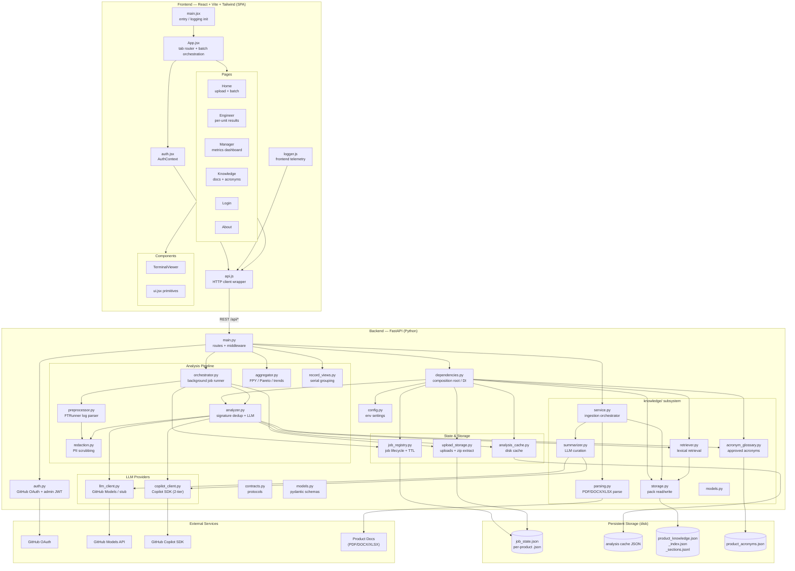
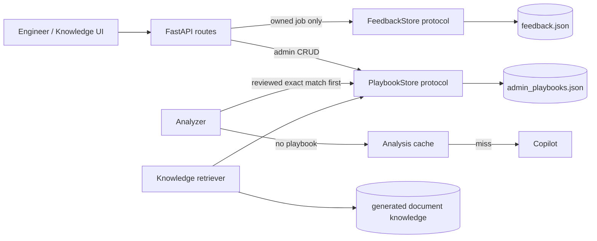
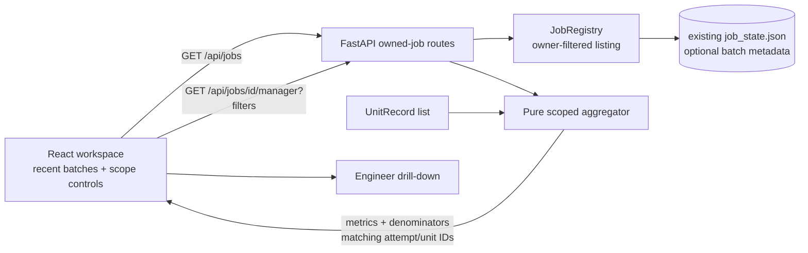
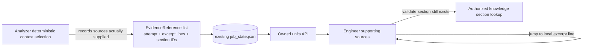
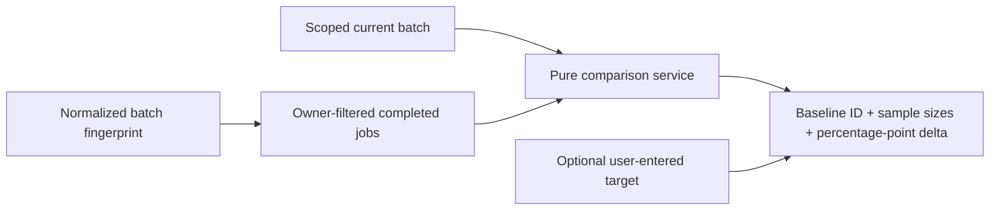
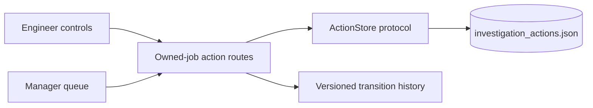
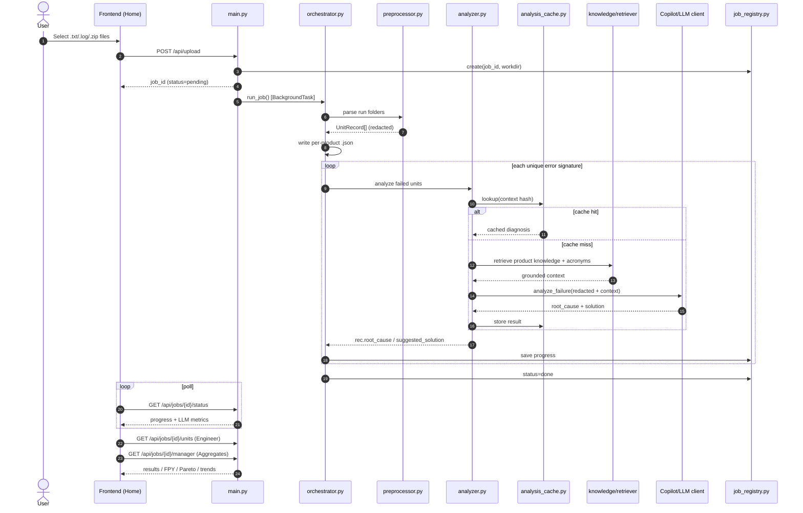

# Co_Trace — Architecture

Co_Trace is a manufacturing test-log triage platform. It ingests FTRunner production logs, preprocesses them into normalized records, runs LLM-assisted root-cause analysis (grounded in a curated product-knowledge pack and an acronym glossary), and surfaces results through Engineer and Manager views.

## System Overview



## Approved Debug Memory Extension

The generated knowledge pack cannot own engineer feedback or admin-authored playbooks. Feedback
must survive a page/job reload, while `KnowledgeService.rebuild()` replaces every generated
`KnowledgeSection` and would erase playbooks that did not originate in a source document. Two
small file-backed stores therefore sit beside, rather than inside, the generated pack.



- Both stores use the existing lock plus atomic JSON replacement pattern and are injected from
    `dependencies.py` behind narrow protocols.
- Feedback routes require the existing job-ownership check. Notes are redacted and bounded on
    write; stored failure metadata is an explicit whitelist. Entries expire with the owning job's
    configured TTL and are never exposed across owners.
- Playbook mutation is admin-only. Entries are retained as `draft`, `reviewed`, or `retired` and
    are not deleted by knowledge rebuild or document deletion.
- Analysis precedence is reviewed playbook, in-job cache, disk cache, then Copilot. Playbook
    results are deterministic and are never written to the analysis cache, so retirement takes
    effect without cache cleanup.

## Approved Batch Discovery and Scoped Analytics Extension

The current API can reopen only a known job ID, persisted job state does not retain enough batch
scope and completeness metadata after upload cleanup, and the Manager endpoint cannot apply a
shared product/lot/station/time scope. The frontend cannot reconstruct those facts reliably from
the grouped Engineer response because intermediate passing attempts are intentionally omitted.

The approved extension keeps the existing architecture: `JobRegistry` remains the owner of
file-backed job state, FastAPI retains ownership checks, and `aggregator.py` remains a pure
computation layer. No database or new service is introduced.



- Job listing is owner-filtered and paginated with deterministic creation-time/job-ID ordering.
    It exposes summaries only, never records or log text.
- Existing per-job JSON gains backward-compatible optional metadata for display name, products,
    observed source timestamps, parsed/included counts, unknowns, and categorized warnings.
- Manager filters are applied before first/latest calculations. Measures therefore describe the
    selected records within one uploaded batch, never lifetime manufacturing yield.
- Unknown outcomes remain in unit-outcome totals but are excluded from PASS-rate denominators.
    Records without timestamps are excluded only while a time filter is active and are reported in
    the scope metadata. Source timestamps remain timezone-unspecified unless their values include an
    offset.
- Filtered aggregate rows return matching attempt and unit identifiers so Manager and Engineer
    can use the same selected population without inferring omitted intermediate attempts.
- All collection and detail routes use the existing authenticated owner ID checks. Old job-state
    files load with unavailable optional metadata rather than fabricated values.

## Approved Deterministic Evidence Provenance Extension

`UnitRecord` currently stores the selected redacted context and retrieved knowledge section IDs,
but it does not preserve a typed source-reference contract. The UI therefore cannot validate
section availability or navigate to stable excerpt-local lines without inferring provenance from
display text. The approved extension records only deterministic sources actually supplied to the
analysis; it does not alter prompts or claim that a source proves a generated statement.



- Log references use redacted excerpt-local line numbers only. They never claim original source
    file line precision.
- Knowledge references include only section IDs returned by retrieval and supplied to analysis.
- The UI labels these references `Sources provided to analysis`, not citations or proof.
- Removed/rebuilt sections and invalid excerpt bounds render as unavailable. Existing jobs and
    cached diagnoses without references remain compatible.
- Claim-level source mappings require a separate prompt/provider contract and are not part of
    this extension.

## Approved Owner-Scoped Historical Comparison Extension

Historical deltas cannot be inferred safely from one job. The existing registry already retains
owned completed job state, so comparisons remain inside that boundary. Completed jobs gain a
deterministic fingerprint over normalized attempt identity and outcome fields to exclude duplicate
re-uploads. No new history database is introduced.



- The baseline is the newest prior owned, completed, non-duplicate job with the same effective
    product scope and nonempty results under active lot/station filters.
- Absolute date filters are not replayed against prior batches. Each comparison reports current
    and baseline observed periods and sample sizes so users can judge comparability.
- Missing fingerprints and incomparable populations return unavailable rather than a fabricated
    delta. Percentage changes are reported as percentage points.
- Targets are optional request/session values with provenance `user_entered`; this extension does
    not create a shared target store or universal thresholds.

## Approved Owner-Only Investigation Action Extension

Engineer feedback records whether guidance was useful, but it cannot safely represent assignment,
status transitions, concurrency, or audit history. A separate atomic JSON action store is added
behind a narrow protocol. It follows the existing feedback/playbook storage pattern and does not
change job ownership or grant access to an assignee.



- Actions belong to an owned job and may target one failed attempt or failure signature. The API
    validates the target against current job records before writing.
- Assignment is an informational team/person label, not an authorization grant. Existing owner
    checks protect every read and mutation.
- Updates require the current version; stale writes return a conflict and preserve both the action
    and its audit history. Every transition records actor, timestamp, previous/new status, owner,
    and next action.
- Actions expire with the job TTL. Cross-user collaboration or shared queues require separate
    approval and are outside this extension.

## Analysis Request Flow



## Data Model (ER-style)

Relationships are logical (in-memory / JSON documents), not a relational DB. `UnitRecord` is the spine: the preprocessor emits one per test run, `record_views.py` groups them per serial, and the analyzer enriches failing units with LLM + knowledge metadata.

```mermaid
erDiagram
    JobStatus ||--|| JobProgress : has
    JobStatus ||--|| LlmUsageMetrics : aggregates
    JobStatus ||--o{ UnitRecord : produces
    SerialUnitGroup ||--|| UnitRecord : "final attempt"
    SerialUnitGroup ||--o{ UnitRecord : "failing attempts"
    UnitRecord ||--o{ StepRecord : "steps[]"
    UnitRecord }o--o{ KnowledgeSection : "knowledge_section_ids"
    UnitRecord }o--o{ AcronymGlossaryEntry : "acronyms_used"
    LlmUsageMetrics ||--|| LlmModelMetrics : "mini"
    LlmUsageMetrics ||--|| LlmModelMetrics : "reasoning"

    KnowledgeManifest ||--o{ ProductManifestEntry : products
    KnowledgeManifest ||--o{ SourceDocumentMeta : documents
    SourceDocumentMeta ||--o{ KnowledgeSection : "produces (doc_id)"
    KnowledgeIndex ||--o{ SectionIndexEntry : "by_product"
    SectionIndexEntry ||--|| KnowledgeSection : "byte-offset -> JSONL"
    KnowledgeSection ||--o{ KnownFailureEntry : known_failures
    KnowledgeSection ||--o{ AcronymDefinition : acronyms
    KnowledgeSection ||--o{ LimitSpecRecord : limits
    KnowledgeContext ||--o{ RetrievalMatch : matches

    UnitRecord {
        string unit_id PK
        string serial_number
        string product_code FK
        string station_id
        string host
        string start_time
        string end_time
        float duration_s
        enum result "PASS|FAIL|UNKNOWN"
        string error_code
        string error_message
        string failing_step
        enum device_class "pan|aic|unknown"
        bool has_debuglog
        string debug_excerpt "transient"
        string signature "SHA1 dedup key"
        string root_cause "LLM"
        string suggested_solution "LLM"
        string analysis_source "llm|cached|local-cache|stub"
        string analysis_cache_key
        bool knowledge_used
        string knowledge_hash
        string knowledge_match_status
        list knowledge_section_ids FK
        list acronyms_used
        list unknown_acronyms
    }

    StepRecord {
        string name
        enum result "PASS|FAIL|UNKNOWN"
        float duration_s
    }

    SerialUnitGroup {
        string serial_number
        string unit_id "final attempt PK"
        enum classification "first_pass|retry_pass|fail|unknown"
        enum result
        int attempt_count
        int failure_count
    }

    JobStatus {
        string job_id PK
        enum status "pending|running|done|error|cancelled"
        string message
        int unit_count
        list warnings
    }

    JobProgress {
        int processed
        int total
    }

    LlmUsageMetrics {
        string provider
        int cache_hits
        int local_cache_hits
        int disk_cache_hits
        int total_calls
        float total_estimated_credits
    }

    LlmModelMetrics {
        string model
        int calls
        int errors
        int input_tokens
        int output_tokens
        float estimated_credits
    }

    KnowledgeManifest {
        int schema_version "2 (rfc_knowledge added)"
        string generated_at
        string summary_model
        string global_hash
    }

    ProductManifestEntry {
        string product_code PK
        int document_count
        int section_count
        string knowledge_hash
    }

    SourceDocumentMeta {
        string doc_id PK
        string filename
        string product_code FK
        string product_family_code FK "base code for RFC family match"
        enum category "hld|debug_learning|product_overview|rfc_knowledge|uncategorized"
        string content_hash
        int section_count
    }

    KnowledgeSection {
        string section_id PK
        string doc_id FK
        string product_code FK
        string product_family_code FK "base code for RFC family match"
        enum category "hld|debug_learning|product_overview|rfc_knowledge|uncategorized"
        string heading
        string summary "curated, no raw text"
        list keywords
        string summary_model
    }

    SectionIndexEntry {
        string section_id PK
        string product_code FK
        string product_family_code FK "base code for RFC family match"
        enum category
        int priority "rfc_knowledge=4 > debug_learning=3 > hld=2 > product_overview=1"
        map token_weights
        int byte_offset
        int byte_length
    }

    KnownFailureEntry {
        string symptom
        string log_signature
        string failing_step
        string root_cause
        string corrective_action
        list rfc_references "RfcReference[]"
    }

    RfcReference {
        string rfc_id
        string notes
        string failed_test_name
        string error_message_or_finding
    }

    AcronymDefinition {
        string acronym
        string definition
    }

    LimitSpecRecord {
        string name
        string value
        string unit
    }

    KnowledgeContext {
        string product_code FK
        string knowledge_hash
        enum match_status "matched|no_match|no_product_knowledge|disabled|no_product_code"
        bool matched
        string context_text "assembled prompt"
    }

    RetrievalMatch {
        string section_id FK
        string product_code FK
        enum category
        float score
        string summary
    }

    AcronymGlossaryEntry {
        string acronym PK
        string definition
        string product_code FK "null = global"
        enum status "approved|needs_review|rejected"
        string notes
    }
```



**Notes**

- `debug_excerpt` / `ExtractedSection.text` are *transient* — used to drive the LLM in-process and never persisted with the curated artifacts.
- `signature` = `SHA1(error_code + normalized error_message)`; it is the dedup key that maps many `UnitRecord`s to a single LLM call and cache entry.
- `knowledge_hash` and `acronym_glossary_hash` are folded into the analysis cache key so approving new knowledge/acronyms invalidates stale diagnoses. Invalidation is **targeted, not global**: `product_code` is itself part of the key, so entries are already partitioned per product. `knowledge_hash` is the per-product manifest hash (`manifest.product_hash(product_code)`), so a doc change for product A invalidates only A's diagnoses. `acronym_glossary_hash` is hashed from *only the approved acronym pairs actually used in that record* (not the whole glossary file), so editing an acronym invalidates only diagnoses that referenced it. A full knowledge rebuild is the exception — LLM re-summarization can shift every per-product hash. Changing the model, prompt version, or provider invalidates everything (those fields are also in the key).
- `SectionIndexEntry.byte_offset` / `byte_length` address the exact line in `product_knowledge_sections.jsonl`, so retrieval only deserializes matched sections.

## Key Architectural Patterns

| Pattern | Where |
| --- | --- |
| Dependency Injection / composition root | `dependencies.py` wires singletons; `orchestrator.py` receives collaborators |
| Protocol-based design (duck typing) | `contracts.py` defines `JobRepository`, `Preprocessor`, `FailureAnalyzer` |
| Cache-aside with source tracking | in-memory signature cache → disk `analysis_cache.py` → LLM |
| Signature deduplication | one LLM call per `SHA1(error_code + normalized message)` per job |
| Grounded LLM prompting | curated knowledge pack + approved acronym glossary injected as trusted context |
| Graceful degradation | Copilot SDK → GitHub Models → deterministic offline stub |
| Atomic writes | job state, cache, and knowledge pack use temp file + `os.replace` |
| PII redaction at boundary | `redaction.py` scrubs serials/IPs/MACs/credentials before LLM + at-rest |

## Component Responsibilities

### Frontend (`frontend/src`)
- **App.jsx** — tab-based SPA shell; batch upload orchestration and polling.
- **auth.jsx** — React `AuthContext` (GitHub OAuth + admin login, session expiry).
- **api.js** — HTTP wrapper mapping to all `/api/*` endpoints; dispatches `cotrace:unauthorized` on 401.
- **Pages** — Home (upload), Engineer (per-unit results), Manager (metrics), Knowledge (docs + acronyms), Login, About.

### Backend (`backend/app`)
- **main.py** — FastAPI routes, middleware, job lifecycle endpoints.
- **orchestrator.py** — background pipeline: preprocess → write artifacts → analyze.
- **preprocessor.py** — parses FTRunner logs into normalized `UnitRecord`s.
- **analyzer.py** — dedups failures by signature; injects knowledge/glossary; calls LLM; caches.
- **aggregator.py** — pure computation of FPY, Pareto, trends, station breakdowns.
- **knowledge/** — ingestion (parse → summarize → store) and lexical retrieval of the product-knowledge pack + acronym glossary.
- **job_registry.py / analysis_cache.py / upload_storage.py** — durable job state, diagnosis cache, and upload handling.
- **copilot_client.py / llm_client.py** — LLM provider adapters with two-tier model policy and offline fallback.
```

