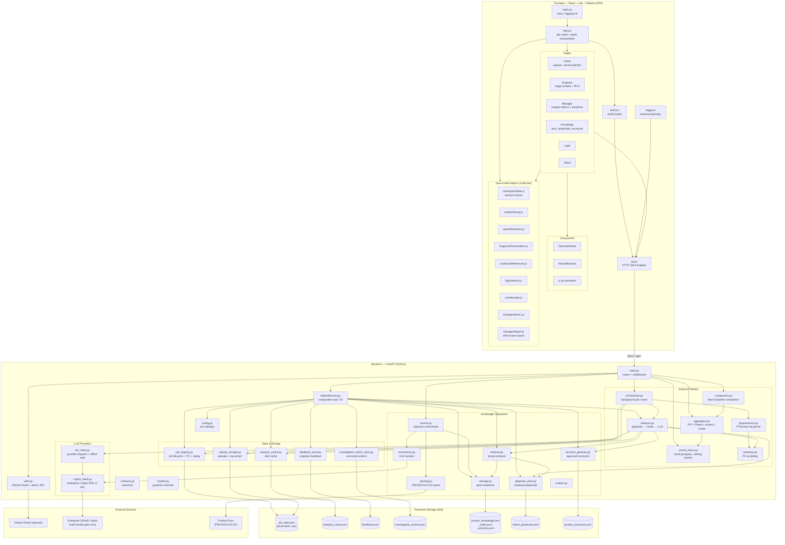
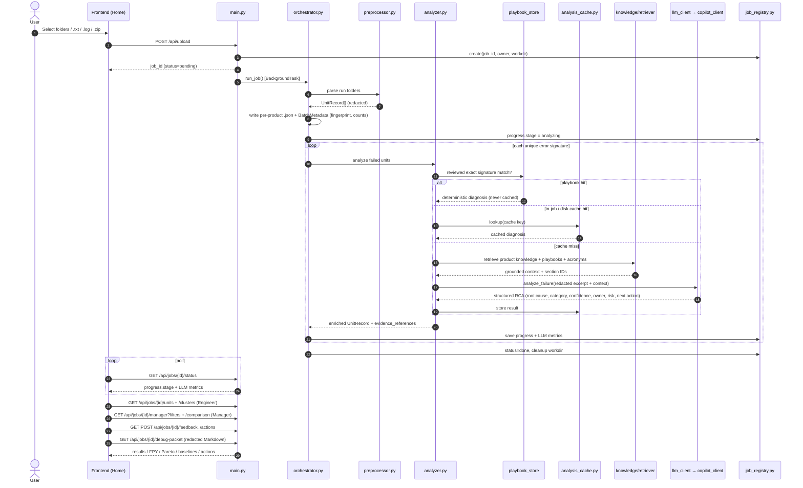

# Co_Trace — Architecture (v2)

Co_Trace is a manufacturing test-log triage platform. It ingests FTRunner production logs, preprocesses them into normalized records, runs LLM-assisted root-cause analysis (grounded in a curated product-knowledge pack, admin-reviewed playbooks, and an acronym glossary), and surfaces results through Engineer and Manager views with feedback, investigation actions, historical comparison, and redacted handoff exports.

## System Overview

## API Surface

| Area | Routes | Access |
| --- | --- | --- |
| Auth | `GET /api/auth/github`, `GET /api/auth/github/callback`, `POST /api/auth/admin/login`, `POST /api/logout`, `GET /api/me` | public / session |
| Jobs | `POST /api/upload`, `GET /api/jobs`, `GET /api/jobs/{id}/status`, `POST /api/jobs/{id}/stop` | owner |
| Engineer | `GET /api/jobs/{id}/units`, `GET /api/jobs/{id}/clusters`, `POST /api/jobs/{id}/units/{unit_id}/reanalyze`, `GET /api/jobs/{id}/debug-packet` | owner |
| Feedback / actions | `GET\|POST /api/jobs/{id}/feedback`, `GET\|POST /api/jobs/{id}/actions`, `PATCH /api/jobs/{id}/actions/{action_id}` | owner |
| Manager | `GET /api/jobs/{id}/manager`, `GET /api/jobs/{id}/comparison` | owner |
| Cache | `DELETE /api/jobs/{id}/cache`, `GET /api/cache/analysis`, `DELETE /api/cache/analysis/{key}` | admin for deletes |
| Knowledge | `GET /api/knowledge`, `GET /api/knowledge/scan`, `GET /api/knowledge/sections[/{id}]`, `GET /api/knowledge/upload/check`, `POST /api/knowledge/upload`, `GET /api/knowledge/jobs/{id}`, `POST /api/knowledge/rebuild`, `DELETE /api/knowledge/documents/{doc_id}`, `DELETE /api/knowledge` | admin for mutations |
| Playbooks | `GET\|POST /api/knowledge/playbooks`, `PATCH\|DELETE /api/knowledge/playbooks/{id}` | admin for mutations |
| Acronyms | `GET\|POST\|DELETE /api/knowledge/acronyms` | admin for mutations |
| Ops | `GET /api/health`, `POST /api/logs/frontend` | public / session |

## Analysis Request Flow

## Data Model (ER-style)

Relationships are logical (in-memory / JSON documents), not a relational DB. `UnitRecord` is the spine: the preprocessor emits one per test run, `record_views.py` groups them per serial, and the analyzer enriches failing units with playbook, cache, LLM, knowledge, and evidence metadata.

```mermaid
erDiagram
    JobStatus ||--|| JobProgress : has
    JobStatus ||--|| LlmUsageMetrics : aggregates
    JobStatus ||--|| BatchMetadata : batch
    JobStatus ||--o{ UnitRecord : produces
    JobSummary ||--|| BatchMetadata : batch
    JobStatus ||--o{ FeedbackEntry : "owned feedback"
    JobStatus ||--o{ InvestigationActionEntry : "owned actions"
    InvestigationActionEntry ||--o{ InvestigationActionEvent : history
    SerialUnitGroup ||--|| UnitRecord : "final attempt"
    SerialUnitGroup ||--o{ UnitRecord : "failing attempts"
    UnitRecord ||--o{ StepRecord : "steps[]"
    UnitRecord ||--o{ EvidenceReference : evidence_references
    UnitRecord }o--o| AdminPlaybookEntry : playbook_id
    UnitRecord }o--o{ KnowledgeSection : "knowledge_section_ids"
    UnitRecord }o--o{ AcronymGlossaryEntry : "acronyms_used"
    EvidenceReference }o--o| KnowledgeSection : section_id
    FeedbackEntry }o--|| UnitRecord : unit_id
    InvestigationActionEntry }o--o| UnitRecord : "unit_id or signature"
    LlmUsageMetrics ||--|| LlmModelMetrics : "mini"
    LlmUsageMetrics ||--|| LlmModelMetrics : "reasoning"

    KnowledgeManifest ||--o{ ProductManifestEntry : products
    KnowledgeManifest ||--o{ SourceDocumentMeta : documents
    SourceDocumentMeta ||--o{ KnowledgeSection : "produces (doc_id)"
    KnowledgeIndex ||--o{ SectionIndexEntry : "by_product"
    SectionIndexEntry ||--|| KnowledgeSection : "byte-offset -> JSONL"
    KnowledgeSection ||--o{ KnownFailureEntry : known_failures
    KnowledgeSection ||--o{ AcronymDefinition : acronyms
    KnowledgeSection ||--o{ LimitSpecRecord : limits
    KnownFailureEntry ||--o{ RfcReference : rfc_references
    AdminPlaybookEntry ||--|| KnownFailureEntry : extends
    KnowledgeContext ||--o{ RetrievalMatch : matches
    KnowledgeContext ||--o{ AdminPlaybookEntry : admin_playbooks

    UnitRecord {
        string unit_id PK
        string serial_number
        string product_code FK
        string lot_id
        string op_id
        string station_id
        string host
        string start_time
        string end_time
        float duration_s
        enum result "PASS|FAIL|UNKNOWN"
        string error_code
        string error_message
        string failing_step
        enum device_class "pan|aic|unknown"
        bool has_debuglog
        string debug_excerpt "transient"
        string signature "SHA1 dedup key"
        string root_cause
        string suggested_solution
        string analysis_source "llm|cached|local-cache|stub|playbook"
        string analysis_context_source "debug_excerpt|ftrunner_snippet|error_message"
        string analysis_cache_key
        string playbook_id FK
        float confidence
        string root_cause_category
        string evidence_summary
        string next_debug_action
        string likely_owner
        string safety_or_escape_risk
        bool needs_more_evidence
        bool knowledge_used
        string knowledge_hash
        string knowledge_match_status
        list knowledge_section_ids FK
        list acronyms_used
        list unknown_acronyms
        string acronym_glossary_hash
    }

    StepRecord {
        string name
        enum result "PASS|FAIL|UNKNOWN"
        float duration_s
    }

    EvidenceReference {
        enum kind "log_excerpt|knowledge_section"
        string reference_id
        string label
        string source_type
        int line_start "excerpt-local"
        int line_end "excerpt-local"
        string section_id FK
        string product_code
        string heading
        string source_filename
    }

    SerialUnitGroup {
        string serial_number
        string unit_id "final attempt PK"
        enum classification "first_pass|retry_pass|fail|unknown"
        enum result
        int attempt_count
        int failure_count
    }

    JobStatus {
        string job_id PK
        enum status "pending|running|done|error|cancelled"
        string message
        float elapsed_s
        int unit_count
        list warnings
    }

    JobSummary {
        string job_id PK
        string display_name
        enum status
        float created_at
        float completed_at
        bool result_available
        int unit_count
    }

    JobProgress {
        int processed
        int total
        string stage
    }

    BatchMetadata {
        string display_name
        int source_file_count
        int source_zip_count
        int discovered_run_count
        int included_run_count
        int parse_excluded_count
        int incomplete_folder_count
        int unknown_result_count
        int missing_debuglog_count
        list product_codes
        string observed_start_time
        string observed_end_time
        enum timestamp_timezone "offset|unspecified|mixed|unavailable"
        string batch_fingerprint "duplicate re-upload guard"
    }

    LlmUsageMetrics {
        string provider
        int cache_hits
        int local_cache_hits
        int disk_cache_hits
        int calls_skipped_by_cache
        int playbook_hits
        int total_calls
        float total_estimated_credits
    }

    LlmModelMetrics {
        string model
        int calls
        int errors
        int input_tokens
        int output_tokens
        float estimated_credits
    }

    FeedbackEntry {
        string feedback_id PK
        string job_id FK
        string owner_id
        string unit_id FK
        string signature
        string cache_key
        string analysis_source
        enum action "helpful|not_helpful|fixed_after_action|not_root_cause"
        string note "redacted, bounded"
        string created_at
        float expires_at "job TTL"
    }

    InvestigationActionEntry {
        string action_id PK
        string job_id FK
        string owner_id
        string unit_id FK
        string signature
        string assignee "informational label"
        string next_action
        enum status "open|in_progress|blocked|resolved"
        int version "optimistic concurrency"
        string created_at
        string updated_at
        float expires_at "job TTL"
    }

    InvestigationActionEvent {
        int version
        string actor_id
        string changed_at
        enum previous_status
        enum status
        string previous_assignee
        string assignee
        string next_action
    }

    AdminPlaybookEntry {
        string playbook_id PK
        string product_code FK
        enum review_status "draft|reviewed|retired"
        string log_signature
        string root_cause
        string corrective_action
    }

    KnowledgeManifest {
        int schema_version "2 (rfc_knowledge added)"
        string generated_at
        string summary_model
        string global_hash
    }

    ProductManifestEntry {
        string product_code PK
        int document_count
        int section_count
        string knowledge_hash
    }

    SourceDocumentMeta {
        string doc_id PK
        string filename
        string product_code FK
        string product_family_code FK "base code for RFC family match"
        enum category "hld|debug_learning|product_overview|rfc_knowledge|uncategorized"
        string content_hash
        int section_count
    }

    KnowledgeSection {
        string section_id PK
        string doc_id FK
        string product_code FK
        string product_family_code FK "base code for RFC family match"
        enum category "hld|debug_learning|product_overview|rfc_knowledge|uncategorized"
        string heading
        string summary "curated, no raw text"
        list keywords
        string summary_model
    }

    SectionIndexEntry {
        string section_id PK
        string product_code FK
        string product_family_code FK "base code for RFC family match"
        enum category
        int priority "rfc_knowledge=4 > debug_learning=3 > hld=2 > product_overview=1"
        map token_weights
        int byte_offset
        int byte_length
    }

    KnownFailureEntry {
        string symptom
        string log_signature
        string failing_step
        string root_cause
        string corrective_action
        list rfc_references "RfcReference[]"
    }

    RfcReference {
        string rfc_id
        string notes
        string failed_test_name
        string error_message_or_finding
    }

    AcronymDefinition {
        string acronym
        string definition
    }

    LimitSpecRecord {
        string name
        string value
        string unit
    }

    KnowledgeContext {
        string product_code FK
        string knowledge_hash
        enum match_status "matched|no_match|no_product_knowledge|disabled|no_product_code"
        bool matched
        string context_text "assembled prompt"
    }

    RetrievalMatch {
        string section_id FK
        string product_code FK
        enum category
        float score
        string summary
    }

    AcronymGlossaryEntry {
        string acronym PK
        string definition
        string product_code FK "null = global"
        enum status "approved|needs_review|rejected"
        string notes
    }
```

**Notes**

- `debug_excerpt` / `ExtractedSection.text` are *transient* — used to drive the LLM in-process and never persisted with the curated artifacts.
- `signature` = `SHA1(error_code + normalized error_message)`; it is the dedup key that maps many `UnitRecord`s to a single playbook match, LLM call, and cache entry.
- `knowledge_hash` and `acronym_glossary_hash` are folded into the analysis cache key so approving new knowledge/acronyms invalidates stale diagnoses. Invalidation is **targeted, not global**: `product_code` is part of the key, `knowledge_hash` is the per-product manifest hash, and `acronym_glossary_hash` covers only the approved acronym pairs used by that record. A full knowledge rebuild can shift every per-product hash. Changing the model, prompt version, or provider invalidates everything.
- Playbook diagnoses are deterministic and never written to the analysis cache, so retiring a playbook takes effect without cache cleanup.
- `EvidenceReference` line numbers are redacted excerpt-local; they never claim original source-file line precision.
- `SectionIndexEntry.byte_offset` / `byte_length` address the exact line in `product_knowledge_sections.jsonl`, so retrieval only deserializes matched sections.

## Key Architectural Patterns

| Pattern | Where |
| --- | --- |
| Dependency Injection / composition root | `dependencies.py` wires singletons (registry, cache, feedback, actions, playbooks, knowledge); `orchestrator.py` receives collaborators |
| Protocol-based design (duck typing) | `contracts.py` defines `JobRepository`, `JobStateStore`, `Preprocessor`, `ArtifactWriter`, `LLMProvider`, `AnalysisCache`, `FeedbackStore`, `InvestigationActionStore`, `PlaybookStore`, `FailureAnalyzer`, `PayloadCleaner`, `ProductKnowledgeRetriever` |
| Layered diagnosis precedence | reviewed playbook → in-job signature cache → disk `analysis_cache.py` → LLM |
| Signature deduplication | one diagnosis per `SHA1(error_code + normalized message)` per job |
| Grounded LLM prompting | curated knowledge pack + reviewed playbooks + approved acronym glossary injected as trusted context |
| Explicit provider selection | `LLM_PROVIDER=copilot_sdk` (enterprise host enforced) or `offline_stub`; no public GitHub Models path |
| Pure computation layers | `aggregator.py`, `comparison.py`, `record_views.py` operate on `UnitRecord` lists without I/O |
| Owner-scoped access | every job, feedback, action, and comparison route checks the authenticated owner; admin-only for cache/knowledge/playbook mutation |
| Optimistic concurrency | investigation actions require `expected_version`; stale writes return conflict |
| Atomic writes | job state, cache, feedback, actions, playbooks, and knowledge pack use temp file + `os.replace` |
| PII redaction at boundary | `redaction.py` scrubs serials/IPs/MACs/credentials before LLM, at rest, in feedback notes, and in debug packets |

## Component Responsibilities

### Frontend (`frontend/src`)
- **App.jsx** — tab-based SPA shell; batch upload orchestration, polling, and workspace restore.
- **auth.jsx** — React `AuthContext` (GitHub OAuth + admin login, session expiry).
- **api.js** — HTTP wrapper mapping to all `/api/*` endpoints; dispatches `cotrace:unauthorized` on 401.
- **Pages** — Home (upload + recent batches), Engineer (triage worklist, clusters, RCA, evidence, feedback, actions, debug packets), Manager (scoped FPY, Pareto, retest burden, baselines, drill-down, report export), Knowledge (docs, coverage queue, playbooks, acronyms), Login, About.
- **Components** — `TerminalViewer` (log search with context), `RecentBatches`, `ui.jsx` primitives.
- **Helpers** — pure view-model modules (`workspaceState`, `jobMonitoring`, `uploadSelection`, `diagnosisPresentation`, `evidenceReferences`, `logEvidence`, `unitAttempts`, `managerMetrics`, `managerReport`), each covered by `node:test`.

### Backend (`backend/app`)
- **main.py** — FastAPI routes, middleware, job lifecycle, ownership and admin checks.
- **orchestrator.py** — background pipeline: preprocess → batch metadata + artifacts → analyze → cleanup.
- **preprocessor.py** — parses FTRunner logs into normalized `UnitRecord`s.
- **analyzer.py** — dedups failures by signature; applies playbooks; injects knowledge/glossary; calls LLM; records evidence references; caches.
- **aggregator.py** — pure computation of FPY, Pareto, trends, station breakdowns, failure clusters, and scoped filtering.
- **comparison.py** — owner-scoped baseline comparison against the newest comparable prior batch.
- **record_views.py** — signatures, serial grouping, attempt classification, redacted debug-packet export.
- **job_registry.py / analysis_cache.py / upload_storage.py** — durable job state and listing, diagnosis cache, and upload handling.
- **feedback_store.py / investigation_action_store.py** — atomic JSON stores for engineer feedback and versioned investigation actions, expiring with job TTL.
- **knowledge/** — ingestion (parse → summarize → store), lexical retrieval, admin playbook store, and acronym glossary.
- **copilot_client.py / llm_client.py** — enterprise Copilot adapter with two-tier model policy, and provider dispatch with deterministic offline stub.

## Extension Design Records

The following sections record the justification and constraints for each approved extension now reflected above.

### Debug Memory (feedback + playbooks)

The generated knowledge pack cannot own engineer feedback or admin-authored playbooks. Feedback
must survive a page/job reload, while `KnowledgeService.rebuild()` replaces every generated
`KnowledgeSection` and would erase playbooks that did not originate in a source document. Two
small file-backed stores therefore sit beside, rather than inside, the generated pack.

- Both stores use the lock plus atomic JSON replacement pattern and are injected from
    `dependencies.py` behind narrow protocols.
- Feedback routes require the job-ownership check. Notes are redacted and bounded on write;
    stored failure metadata is an explicit whitelist. Entries expire with the owning job's TTL and
    are never exposed across owners.
- Playbook mutation is admin-only. Entries are retained as `draft`, `reviewed`, or `retired` and
    are not deleted by knowledge rebuild or document deletion.

### Batch Discovery and Scoped Analytics

- Job listing is owner-filtered and paginated with deterministic creation-time/job-ID ordering.
    It exposes summaries only, never records or log text.
- Per-job JSON carries backward-compatible optional `BatchMetadata`. Old job-state files load
    with unavailable metadata rather than fabricated values.
- Manager filters are applied before first/latest calculations, so measures describe the selected
    records within one uploaded batch, never lifetime manufacturing yield.
- Unknown outcomes remain in unit-outcome totals but are excluded from PASS-rate denominators.
    Records without timestamps are excluded only while a time filter is active and are reported in
    the scope metadata.
- Filtered aggregate rows return matching attempt and unit identifiers so Manager and Engineer
    share the same selected population.

### Deterministic Evidence Provenance

- Only deterministic sources actually supplied to analysis are recorded; prompts are unchanged.
- The UI labels these references `Sources provided to analysis`, not citations or proof.
- Removed/rebuilt sections and invalid excerpt bounds render as unavailable. Jobs and cached
    diagnoses without references remain compatible.
- Claim-level source mappings require a separate prompt/provider contract.

### Owner-Scoped Historical Comparison

- The baseline is the newest prior owned, completed, non-duplicate (by `batch_fingerprint`) job
    with the same effective product scope and nonempty results under active lot/station filters.
- Absolute date filters are not replayed against prior batches; each comparison reports current
    and baseline periods and sample sizes.
- Missing fingerprints and incomparable populations return unavailable rather than a fabricated
    delta. Changes are reported in percentage points.
- Targets are optional request/session values with provenance `user_entered`; there is no shared
    target store.

### Owner-Only Investigation Actions

- Actions belong to an owned job and target one failed attempt or failure signature, validated
    against current job records before writing.
- Assignment is an informational label, not an authorization grant.
- Every transition records actor, timestamp, previous/new status, assignee, and next action.
- Cross-user collaboration or shared queues are outside this design and require separate approval.
