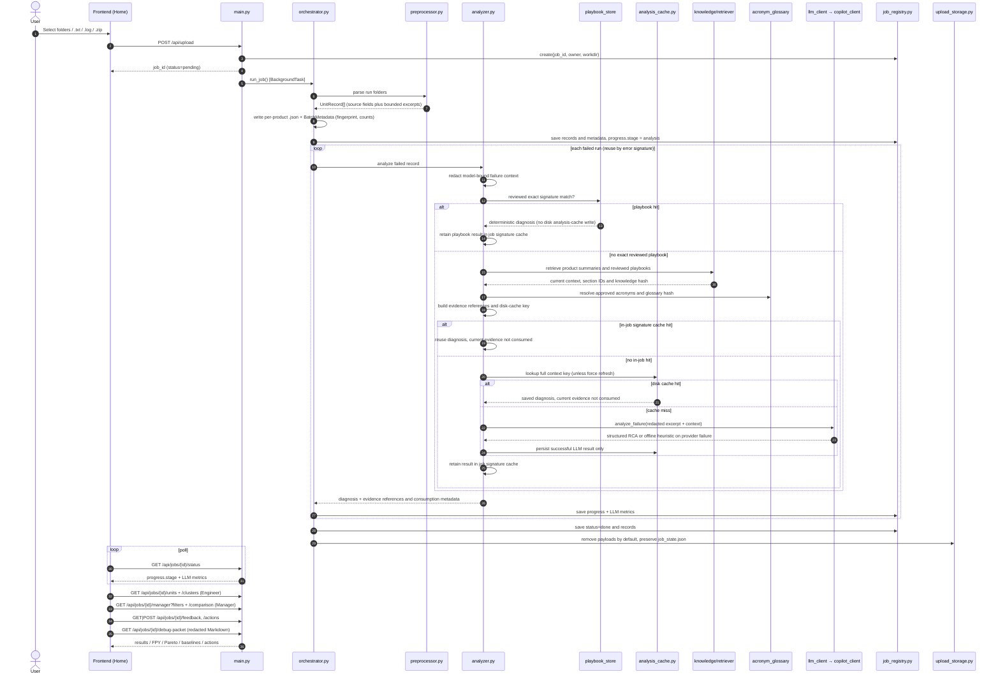

# Co_Trace — Architecture (v2)

Co_Trace is a manufacturing test-log triage platform. It ingests FTRunner production logs, preprocesses them into normalized records, runs LLM-assisted root-cause analysis (grounded in a curated product-knowledge pack, admin-reviewed playbooks, and an acronym glossary), and surfaces results through Engineer and Manager views with feedback, investigation actions, historical comparison, and redacted handoff exports.

Implementation review: 2026-10-07. This document describes the current code, not a production certification. AI means artificial intelligence; LLM means large language model; RCA means root-cause analysis; FPY means first-pass yield; API means application programming interface; TTL means time to live.

## System Boundary and Deployment

- **Included in Co-Trace:** the React browser application, Python/FastAPI backend, log processing, deterministic metrics, diagnosis orchestration, knowledge management, evidence views, feedback/actions, reports, and file-backed application stores.
- **Separately provided:** manufacturing test equipment and source logs, authoritative product documents, engineers and administrators, enterprise GitHub Copilot and its pretrained models/licensing, and the host server, storage infrastructure, network protection, certificates, and operational support.
- **Not implemented:** direct manufacturing execution/quality-system integration, equipment control, automated product-release decisions, individual ordinary-user authorization, model training, a distributed worker queue, or live synchronization between browsers. Engineers act on recommendations outside Co-Trace.
- **Runtime:** one backend process can serve both the built frontend and API. Development uses Vite on port 5173 with `/api` proxied to port 8000. Upload analysis runs in process through FastAPI background tasks; registries, locks, and knowledge-upload progress are process-local. File persistence does not make this a distributed or automatically resumable job service.

## System Overview

Prototype access update (2026-09-23): all visitors use one server-controlled `shared-workspace` principal. Home needs no sign-in or personal identity. The existing registry, stores, and dependency boundary are retained; no new service or storage architecture is introduced. Password-protected Admin mode grants maintenance permissions within that same workspace. Copilot authentication stays backend-only. Legacy account-owned jobs are not automatically published, and anonymous history does not identify individuals. Deploy only within a trusted network.

```mermaid
graph TB
    subgraph Client["Frontend — React + Vite + Tailwind (SPA)"]
        direction TB
        Main["main.jsx<br/>entry / logging init"]
        AppShell["App.jsx<br/>tab router + batch orchestration"]
        Auth["auth.jsx<br/>shared workspace + Admin role"]
        ApiJs["api.js<br/>HTTP client wrapper"]
        Logger["logger.js<br/>frontend telemetry"]

        subgraph Pages["Pages"]
            Home["Home<br/>upload + recent batches"]
            Engineer["Engineer<br/>triage worklist + RCA"]
            Manager["Manager<br/>scoped metrics + baselines"]
            Knowledge["Knowledge<br/>docs, playbooks, acronyms"]
            About["About"]
        end

        subgraph Comps["Components"]
            TermView["TerminalViewer"]
            Recent["RecentBatches"]
            UI["ui.jsx primitives"]
            AdminDialog["AdminDialog<br/>maintenance sign-in"]
        end

        subgraph Helpers["View-model helpers (node:test)"]
            WorkspaceState["workspaceState.js<br/>session restore"]
            AppUrl["appUrl.js<br/>compact investigation URLs"]
            JobMonitor["jobMonitoring.js"]
            UploadSel["uploadSelection.js"]
            DiagPres["diagnosisPresentation.js"]
            EvidenceRefs["evidenceReferences.js"]
            LogEvidence["logEvidence.js"]
            UnitAttempts["unitAttempts.js"]
            MgrMetrics["managerMetrics.js"]
            MgrReport["managerReport.js<br/>shift-review export"]
        end
    end

    subgraph Server["Backend — FastAPI (Python)"]
        direction TB
        MainPy["main.py<br/>routes + middleware"]
        AuthPy["auth.py<br/>shared principal + Admin JWT"]
        Deps["dependencies.py<br/>composition root / DI"]
        Config["config.py<br/>env settings"]
        Contracts["contracts.py<br/>protocols"]
        Models["models.py<br/>pydantic schemas"]

        subgraph Pipeline["Analysis Pipeline"]
            Orchestrator["orchestrator.py<br/>background job runner"]
            Preprocessor["preprocessor.py<br/>FTRunner log parser"]
            Analyzer["analyzer.py<br/>playbook → cache → LLM"]
            Aggregator["aggregator.py<br/>FPY / Pareto / clusters / scope"]
            Comparison["comparison.py<br/>batch baseline comparison"]
            RecordViews["record_views.py<br/>serial grouping + debug packet"]
            Chronology["timestamp_ordering.py<br/>comparable first/latest ordering"]
            Fingerprints["fingerprints.py<br/>batch duplicate detection"]
            Redaction["redaction.py<br/>PII scrubbing"]
        end

        subgraph State["State & Storage"]
            JobReg["job_registry.py<br/>job lifecycle + TTL + listing"]
            AnalysisCache["analysis_cache.py<br/>disk cache"]
            UploadStore["upload_storage.py<br/>uploads + zip extract"]
            KnowledgeJobs["main.py knowledge-upload jobs<br/>in-memory progress only"]
            FeedbackStore["feedback_store.py<br/>engineer feedback"]
            ActionStore["investigation_action_store.py<br/>versioned actions"]
        end

        subgraph LLM["LLM Providers"]
            LlmClient["llm_client.py<br/>provider dispatch + offline stub"]
            CopilotClient["copilot_client.py<br/>enterprise Copilot HTTPS via httpx (2-tier)"]
        end

        subgraph KnowledgeSub["knowledge/ subsystem"]
            KService["service.py<br/>ingestion orchestrator"]
            KParsing["parsing.py<br/>PDF/DOCX/XLSX parse"]
            KSummarizer["summarizer.py<br/>LLM curation"]
            KRetriever["retriever.py<br/>lexical retrieval"]
            KStorage["storage.py<br/>pack read/write"]
            KPlaybook["playbook_store.py<br/>reviewed playbooks"]
            KGlossary["acronym_glossary.py<br/>approved acronyms"]
            KModels["models.py"]
        end
    end

    subgraph Disk["Persistent Storage (disk)"]
        WorkDir[("job_state.json<br/>records, excerpts, progress and batch metadata")]
        CacheDir[("analysis_cache.json")]
        FeedbackDisk[("feedback.json")]
        ActionsDisk[("investigation_actions.json")]
        Pack[("product_knowledge.json<br/>_index.json<br/>_sections.jsonl")]
        PlaybookDisk[("admin_playbooks.json")]
        Glossary[("product_acronyms.json")]
    end

    Payloads["Temporary local payloads<br/>uploads, extracted logs, per-product .json"]

    subgraph External["External Services"]
        CopilotAPI["Enterprise GitHub Copilot API<br/>(allowlisted HTTPS, PAT or exchanged token)"]
        Docs["Product Docs<br/>(PDF/DOCX/XLSX; source files retained locally)"]
    end

    %% Frontend wiring
    Main --> AppShell
    AppShell --> Auth
    AppShell --> Pages
    AppShell --> Helpers
    Pages --> Comps
    Pages --> Helpers
    Pages --> ApiJs
    Auth --> ApiJs
    Logger --> ApiJs

    %% Frontend -> Backend
    ApiJs -->|"REST /api/*"| MainPy

    %% Backend routing
    MainPy --> AuthPy
    MainPy --> Deps
    MainPy --> Orchestrator
    MainPy --> Aggregator
    MainPy --> Comparison
    MainPy --> RecordViews
    MainPy --> KService
    MainPy --> UploadStore
    MainPy --> KnowledgeJobs
    KnowledgeJobs --> KService
    Deps --> Config
    Deps --> JobReg
    Deps --> AnalysisCache
    Deps --> Orchestrator
    Deps --> FeedbackStore
    Deps --> ActionStore
    Deps --> Analyzer
    Deps --> KStorage
    Deps --> KRetriever
    Deps --> KPlaybook
    Deps --> KGlossary

    %% Pipeline flow
    Orchestrator --> Preprocessor
    Orchestrator --> Analyzer
    Orchestrator --> JobReg
    Orchestrator --> UploadStore
    Orchestrator --> Fingerprints
    Orchestrator --> Chronology
    Preprocessor --> Payloads
    Preprocessor --> Redaction
    Analyzer --> Redaction
    Analyzer --> KPlaybook
    Analyzer --> AnalysisCache
    Analyzer --> KRetriever
    Analyzer --> KGlossary
    Analyzer --> LlmClient
    LlmClient --> CopilotClient
    Aggregator --> RecordViews
    Aggregator --> Chronology
    Comparison --> Aggregator
    Comparison --> Fingerprints
    RecordViews --> Chronology

    %% Knowledge ingestion + retrieval
    KService --> KParsing
    KService --> KSummarizer
    KService --> KStorage
    KSummarizer --> CopilotClient
    KRetriever --> KStorage
    KRetriever --> KPlaybook
    KParsing --> Docs

    %% External
    CopilotClient -->|"diagnosis context or document sections"| CopilotAPI

    %% Disk persistence
    JobReg --> WorkDir
    UploadStore --> Payloads
    AnalysisCache --> CacheDir
    FeedbackStore --> FeedbackDisk
    ActionStore --> ActionsDisk
    KStorage --> Pack
    KPlaybook --> PlaybookDisk
    KGlossary --> Glossary
```

## API Surface

| Area | Routes | Access |
| --- | --- | --- |
| Access / Admin | `POST /api/auth/admin/login`, `POST /api/logout`, `GET /api/me`; old GitHub OAuth routes return 410 | shared workspace / Admin session |
| Jobs | `POST /api/upload`, `GET /api/jobs`, `GET /api/jobs/{id}/status`, `POST /api/jobs/{id}/stop` | shared-workspace owner |
| Engineer | `GET /api/jobs/{id}/units`, `GET /api/jobs/{id}/clusters`, `POST /api/jobs/{id}/units/{unit_id}/reanalyze`, `GET /api/jobs/{id}/debug-packet` | shared-workspace owner |
| Feedback / actions | `GET\|POST /api/jobs/{id}/feedback`, `GET\|POST /api/jobs/{id}/actions`, `PATCH /api/jobs/{id}/actions/{action_id}` | shared-workspace owner |
| Manager | `GET /api/jobs/{id}/manager`, `GET /api/jobs/{id}/comparison` | shared-workspace owner |
| Cache | `DELETE /api/jobs/{id}/cache`, `GET /api/cache/analysis`, `DELETE /api/cache/analysis/{key}` | admin for deletes |
| Knowledge reads | `GET /api/knowledge`, `GET /api/knowledge/scan`, `GET /api/knowledge/sections[/{id}]`, `GET /api/knowledge/jobs/{id}` | shared workspace |
| Knowledge maintenance | `GET /api/knowledge/upload/check`, `POST /api/knowledge/upload`, `POST /api/knowledge/rebuild`, `DELETE /api/knowledge/documents/{doc_id}`, `DELETE /api/knowledge` | admin, including the duplicate-file check |
| Playbooks | `GET\|POST /api/knowledge/playbooks`, `PATCH\|DELETE /api/knowledge/playbooks/{id}` | admin for mutations |
| Acronyms | `GET\|POST\|DELETE /api/knowledge/acronyms` | admin for mutations |
| Ops | `GET /api/health`, `POST /api/logs/frontend` | public; frontend-log writes still pass mutation-origin checks |

## Analysis Request Flow

```mermaid
sequenceDiagram
    autonumber
    actor User
    participant FE as Frontend (Home)
    participant API as main.py
    participant Orch as orchestrator.py
    participant Pre as preprocessor.py
    participant Anz as analyzer.py
    participant PB as playbook_store
    participant Cache as analysis_cache.py
    participant KR as knowledge/retriever
    participant Glossary as acronym_glossary
    participant LLM as llm_client → copilot_client
    participant Job as job_registry.py
    participant Uploads as upload_storage.py

    User->>FE: Select folders / .txt / .log / .zip
    FE->>API: POST /api/upload
    API->>Job: create(job_id, owner, workdir)
    API-->>FE: job_id (status=pending)
    API->>Orch: run_job() [BackgroundTask]

    Orch->>Pre: parse run folders
    Pre-->>Orch: UnitRecord[] (source fields plus bounded excerpts)
    Orch->>Orch: write per-product .json + BatchMetadata (fingerprint, counts)
    Orch->>Job: save records and metadata, progress.stage = analysis

    loop each failed run (reuse by error signature)
        Orch->>Anz: analyze failed record
        Anz->>Anz: redact model-bound failure context
        Anz->>PB: reviewed exact signature match?
        alt playbook hit
            PB-->>Anz: deterministic diagnosis (no disk analysis-cache write)
            Anz->>Anz: retain playbook result in job signature cache
        else no exact reviewed playbook
            Anz->>KR: retrieve product summaries and reviewed playbooks
            KR-->>Anz: current context, section IDs and knowledge hash
            Anz->>Glossary: resolve approved acronyms and glossary hash
            Anz->>Anz: build evidence references and disk-cache key
            alt in-job signature cache hit
                Anz->>Anz: reuse diagnosis, current evidence not consumed
            else no in-job hit
                Anz->>Cache: lookup full context key (unless force refresh)
                alt disk cache hit
                    Cache-->>Anz: saved diagnosis, current evidence not consumed
                else cache miss
                    Anz->>LLM: analyze_failure(redacted excerpt + context)
                    LLM-->>Anz: structured RCA or offline heuristic on provider failure
                    Anz->>Cache: persist successful LLM result only
                end
                Anz->>Anz: retain result in job signature cache
            end
        end
        Anz-->>Orch: diagnosis + evidence references and consumption metadata
        Orch->>Job: save progress + LLM metrics
    end

    Orch->>Job: save status=done and records
    Orch->>Uploads: remove payloads by default, preserve job_state.json

    loop poll
        FE->>API: GET /api/jobs/{id}/status
        API-->>FE: progress.stage + LLM metrics
    end

    FE->>API: GET /api/jobs/{id}/units + /clusters (Engineer)
    FE->>API: GET /api/jobs/{id}/manager?filters + /comparison (Manager)
    FE->>API: GET|POST /api/jobs/{id}/feedback, /actions
    FE->>API: GET /api/jobs/{id}/debug-packet (redacted Markdown)
    API-->>FE: results / FPY / Pareto / baselines / actions
```

## Data Model (ER-style)

Relationships are logical (in-memory / JSON documents), not a relational DB. `UnitRecord` is the spine: the preprocessor emits one per test run, `record_views.py` groups them per serial, and the analyzer enriches failing units with playbook, cache, LLM, knowledge, and evidence metadata.

```mermaid
erDiagram
    JobStatus ||--|| JobProgress : has
    JobStatus ||--|| LlmUsageMetrics : aggregates
    JobStatus ||--|| BatchMetadata : batch
    JobStatus ||--o{ UnitRecord : produces
    JobSummary ||--|| BatchMetadata : batch
    JobStatus ||--o{ FeedbackEntry : "owned feedback"
    JobStatus ||--o{ InvestigationActionEntry : "owned actions"
    InvestigationActionEntry ||--o{ InvestigationActionEvent : history
    SerialUnitGroup ||--|| UnitRecord : "final attempt"
    SerialUnitGroup ||--o{ UnitRecord : "failing attempts"
    UnitRecord ||--o{ StepRecord : "steps[]"
    UnitRecord ||--o{ EvidenceReference : evidence_references
    UnitRecord }o--o| AdminPlaybookEntry : playbook_id
    UnitRecord }o--o{ KnowledgeSection : "knowledge_section_ids"
    UnitRecord }o--o{ AcronymGlossaryEntry : "acronyms_used"
    EvidenceReference }o--o| KnowledgeSection : section_id
    FeedbackEntry }o--|| UnitRecord : unit_id
    InvestigationActionEntry }o--o| UnitRecord : "unit_id or signature"
    LlmUsageMetrics ||--|| LlmModelMetrics : "mini"
    LlmUsageMetrics ||--|| LlmModelMetrics : "reasoning"

    KnowledgeManifest ||--o{ ProductManifestEntry : products
    KnowledgeManifest ||--o{ SourceDocumentMeta : documents
    SourceDocumentMeta ||--o{ KnowledgeSection : "produces (doc_id)"
    KnowledgeIndex ||--o{ SectionIndexEntry : "by_product"
    SectionIndexEntry ||--|| KnowledgeSection : "byte-offset -> JSONL"
    KnowledgeSection ||--o{ KnownFailureEntry : known_failures
    KnowledgeSection ||--o{ AcronymDefinition : acronyms
    KnowledgeSection ||--o{ LimitSpecRecord : limits
    KnownFailureEntry ||--o{ RfcReference : rfc_references
    AdminPlaybookEntry ||--|| KnownFailureEntry : extends
    KnowledgeContext ||--o{ RetrievalMatch : matches
    KnowledgeContext ||--o{ AdminPlaybookEntry : admin_playbooks

    UnitRecord {
        string unit_id PK
        string serial_number
        string product_code FK
        string lot_id
        string op_id
        string station_id
        string host
        string start_time
        string end_time
        float duration_s
        enum result "PASS|FAIL|UNKNOWN"
        string error_code
        string error_message
        string failing_step
        enum device_class "pan|aic|unknown"
        bool has_debuglog
        string debuglog_status
        string debug_excerpt "redacted, serial retained; persisted in job state"
        string ftrunner_snippet "source-derived; persisted in job state"
        string redacted_snippet "analysis context"
        string signature "SHA1 dedup key"
        string root_cause
        string suggested_solution
        string analysis_source "llm|cached|local-cache|stub|playbook"
        string analysis_context_source "debug_excerpt|ftrunner_snippet|error_message"
        string analysis_cache_key
        list evidence_references
        bool evidence_consumed "nullable; false for reused diagnoses"
        string analysis_origin_unit_id "origin of in-job diagnosis when known"
        string playbook_id FK
        float confidence
        string root_cause_category
        string evidence_summary
        string next_debug_action
        string likely_owner
        string safety_or_escape_risk
        bool needs_more_evidence
        bool knowledge_used
        string knowledge_hash
        string knowledge_match_status
        list knowledge_section_ids FK
        list acronyms_used
        list unknown_acronyms
        string acronym_glossary_hash
    }

    StepRecord {
        string name
        enum result "PASS|FAIL|UNKNOWN"
        float duration_s
    }

    EvidenceReference {
        enum kind "log_excerpt|knowledge_section"
        string reference_id
        string label
        string source_type
        int line_start "excerpt-local"
        int line_end "excerpt-local"
        string section_id FK
        string product_code
        string heading
        string source_filename
    }

    SerialUnitGroup {
        string serial_number
        string unit_id "final attempt PK"
        enum classification "first_pass|retry_pass|fail|unknown"
        enum result
        int attempt_count
        int failure_count
        string chronology_unavailable_reason
    }

    JobStatus {
        string job_id PK
        enum status "pending|running|done|error|cancelled"
        string message
        float elapsed_s
        int unit_count
        list warnings
    }

    JobSummary {
        string job_id PK
        string display_name
        enum status
        float created_at
        float completed_at
        bool result_available
        int unit_count
    }

    JobProgress {
        int processed
        int total
        string stage
    }

    BatchMetadata {
        string display_name
        int source_file_count
        int source_zip_count
        int discovered_run_count
        int included_run_count
        int parse_excluded_count
        int incomplete_folder_count
        int unknown_result_count
        int missing_debuglog_count
        list product_codes
        string observed_start_time
        string observed_end_time
        enum timestamp_timezone "offset|unspecified|mixed|unavailable"
        string chronology_unavailable_reason
        string batch_fingerprint "duplicate re-upload guard"
    }

    LlmUsageMetrics {
        string provider
        int cache_hits
        int local_cache_hits
        int disk_cache_hits
        int calls_skipped_by_cache
        int playbook_hits
        int total_calls
        float total_estimated_credits
    }

    LlmModelMetrics {
        string model
        int calls
        int errors
        int input_tokens
        int output_tokens
        float estimated_credits
    }

    FeedbackEntry {
        string feedback_id PK
        string job_id FK
        string owner_id
        string unit_id FK
        string signature
        string cache_key
        string analysis_source
        enum action "helpful|not_helpful|fixed_after_action|not_root_cause"
        string note "redacted, bounded"
        string created_at
        float expires_at "job TTL"
    }

    InvestigationActionEntry {
        string action_id PK
        string job_id FK
        string owner_id
        string unit_id FK
        string signature
        string assignee "informational label"
        string next_action
        enum status "open|in_progress|blocked|resolved"
        int version "optimistic concurrency"
        string created_at
        string updated_at
        float expires_at "job TTL"
    }

    InvestigationActionEvent {
        int version
        string actor_id
        string changed_at
        enum previous_status
        enum status
        string previous_assignee
        string assignee
        string next_action
    }

    AdminPlaybookEntry {
        string playbook_id PK
        string product_code FK
        enum review_status "draft|reviewed|retired"
        string log_signature
        string root_cause
        string corrective_action
    }

    KnowledgeManifest {
        int schema_version "2 (rfc_knowledge added)"
        string generated_at
        string summary_model
        string global_hash
    }

    ProductManifestEntry {
        string product_code PK
        int document_count
        int section_count
        string knowledge_hash
    }

    SourceDocumentMeta {
        string doc_id PK
        string filename
        string product_code FK
        string product_family_code FK "base code for RFC family match"
        enum category "hld|debug_learning|product_overview|rfc_knowledge|uncategorized"
        string content_hash
        int section_count
    }

    KnowledgeSection {
        string section_id PK
        string doc_id FK
        string product_code FK
        string product_family_code FK "base code for RFC family match"
        enum category "hld|debug_learning|product_overview|rfc_knowledge|uncategorized"
        string heading
        string summary "curated, no raw text"
        list keywords
        string summary_model
    }

    SectionIndexEntry {
        string section_id PK
        string product_code FK
        string product_family_code FK "base code for RFC family match"
        enum category
        int priority "rfc_knowledge=4 > debug_learning=3 > hld=2 > product_overview=1"
        map token_weights
        int byte_offset
        int byte_length
    }

    KnownFailureEntry {
        string symptom
        string log_signature
        string failing_step
        string root_cause
        string corrective_action
        list rfc_references "RfcReference[]"
    }

    RfcReference {
        string rfc_id
        string notes
        string failed_test_name
        string error_message_or_finding
    }

    AcronymDefinition {
        string acronym
        string definition
    }

    LimitSpecRecord {
        string name
        string value
        string unit
    }

    KnowledgeContext {
        string product_code FK
        string knowledge_hash
        enum match_status "matched|no_match|no_product_knowledge|disabled|no_product_code"
        bool matched
        string context_text "assembled prompt"
    }

    RetrievalMatch {
        string section_id FK
        string product_code FK
        enum category
        float score
        string summary
    }

    AcronymGlossaryEntry {
        string acronym PK
        string definition
        string product_code FK "null = global"
        enum status "approved|needs_review|rejected"
        string notes
    }
```

**Notes**

- `ExtractedSection.text` is used during document summarization but is not a field in the generated knowledge pack. Ingestion sends extracted document sections to enterprise Copilot; subsequent failure diagnosis sends only selected knowledge summaries, not the source documents.
- `debug_excerpt` is not transient: it is included in per-product artifacts and serialized `UnitRecord`s in `job_state.json`. Excerpt extraction retains serial numbers; the analyzer redacts them again for model-bound failure context. Job state also retains source-derived fields such as serial number, host, error message, and FTRunner snippet; it is not a fully redacted or anonymized store.
- The error-code/normalized-message signature groups failed runs for in-job reuse. The disk-cache key is separate: it includes that signature, redacted context, product, operation, failing step, retrieved section identifiers/categories, knowledge/acronym hashes, and provider/model/prompt identity.
- Cache invalidation is lookup-based, not deletion or automatic reanalysis of reopened jobs. The batch's in-job cache is keyed only by failure signature, so it can reuse a result across differing products or excerpts in that batch. The richer disk key is not an additional guard on an in-job hit. The knowledge hash comes from the first matching product/alias manifest entry, not a hash of every retrieved family-level section or playbook. Do not assume every context edit invalidates every affected saved diagnosis.
- Playbook diagnoses are deterministic and retained in the job signature cache, but never written to the disk analysis cache. On subsequent analysis, the reviewed-playbook lookup runs first; a stale in-job playbook result is discarded when there is no current match. Reopening a completed job alone does not recompute its diagnosis.
- `EvidenceReference` line numbers are redacted excerpt-local; they never claim original source-file line precision.
- `SectionIndexEntry.byte_offset` / `byte_length` address the exact line in `product_knowledge_sections.jsonl`, so retrieval only deserializes matched sections.

## Key Architectural Patterns

| Pattern | Where |
| --- | --- |
| Dependency Injection / composition root | `dependencies.py` wires singletons (registry, cache, feedback, actions, playbooks, knowledge); `orchestrator.py` receives collaborators |
| Protocol-based design (duck typing) | `contracts.py` defines `JobRepository`, `JobStateStore`, `Preprocessor`, `ArtifactWriter`, `LLMProvider`, `AnalysisCache`, `FeedbackStore`, `InvestigationActionStore`, `PlaybookStore`, `FailureAnalyzer`, `PayloadCleaner`, `ProductKnowledgeRetriever` |
| Layered diagnosis precedence | reviewed playbook → in-job signature cache → disk `analysis_cache.py` → LLM |
| Signature deduplication | in-job reuse by normalized failure signature; disk-cache reuse additionally depends on context and model identity |
| Grounded LLM prompting | curated knowledge pack + reviewed playbooks + approved acronym glossary injected as trusted context |
| Explicit provider selection | `LLM_PROVIDER=copilot_http` (HTTPS host allowlist enforced; `copilot_sdk` is a deprecated alias) or `offline_stub`; no public GitHub Models path, SDK, or CLI subprocess |
| Pure computation layers | `aggregator.py`, `comparison.py`, `record_views.py` operate on `UnitRecord` lists without I/O |
| Shared workspace boundary | job, feedback, action, and comparison routes retain the owner filter using the same shared principal for guests and Admin; legacy private jobs remain outside that scope; cache deletes and knowledge/playbook mutations require Admin |
| Optimistic concurrency | investigation actions require `expected_version`; stale writes return conflict |
| Atomic writes | job state, cache, feedback, actions, playbooks, and knowledge pack use temp file + `os.replace` |
| Pattern-based redaction | failure context is redacted before LLM diagnosis; feedback notes and debug packets are redacted; serials remain available for unit grouping and persisted job records are not fully redacted. Document ingestion is a separate external-data flow |

## Component Responsibilities

### Frontend (`frontend/src`)
- **App.jsx** — tab-based SPA shell; batch upload orchestration, polling, and workspace restore.
- **auth.jsx** — React `AuthContext` with a stable shared workspace and optional Admin session. Role changes do not clear navigation or drafts.
- **api.js** — HTTP wrapper mapping to all `/api/*` endpoints; downgrades expired Admin access on 401 or the explicit Admin-required 403 without routing to a login page.
- **Pages** — Home (upload + recent batches), Engineer (triage worklist, clusters, RCA, evidence, feedback, actions, debug packets), Manager (scoped FPY, Pareto, retest burden, baselines, drill-down, report export), Knowledge (docs, coverage queue, playbooks, acronyms), About.
- **Components** — `AdminDialog` (password-protected maintenance), `TerminalViewer` (log search with context), `RecentBatches`, `ui.jsx` primitives.
- **Helpers** — view-model and navigation modules (`workspaceState`, `appUrl`, `jobMonitoring`, `uploadSelection`, `diagnosisPresentation`, `evidenceReferences`, `logEvidence`, `unitAttempts`, `managerMetrics`, `managerReport`); helper and shell behavior is covered by the frontend test suite.

### Backend (`backend/app`)
- **main.py** — FastAPI routes, middleware, job lifecycle, ownership and admin checks.
- **orchestrator.py** — background pipeline: preprocess → batch metadata + artifacts → analyze → cleanup.
- **preprocessor.py** — parses FTRunner logs into normalized `UnitRecord`s.
- **analyzer.py** — dedups failures by signature; applies playbooks; injects knowledge/glossary; calls LLM; records evidence references; caches.
- **aggregator.py** — pure computation of FPY, Pareto, trends, station breakdowns, failure clusters, and scoped filtering.
- **comparison.py** — owner-scoped baseline comparison against the newest comparable prior batch.
- **record_views.py** — signatures, serial grouping, attempt classification, redacted debug-packet export.
- **timestamp_ordering.py / fingerprints.py** — explicit timestamp comparability and chronological ordering, plus stable batch fingerprints for duplicate detection.
- **job_registry.py / analysis_cache.py / upload_storage.py** — durable job state and listing, diagnosis cache, and upload handling.
- **feedback_store.py / investigation_action_store.py** — atomic JSON stores for engineer feedback and versioned investigation actions, expiring with job TTL.
- **knowledge/** — ingestion (parse → summarize → store), lexical retrieval, admin playbook store, and acronym glossary.
- **copilot_client.py / llm_client.py** — enterprise Copilot adapter with two-tier model policy, and provider dispatch with deterministic offline stub.

## Data and Job Lifecycle

- Uploads and extracted files are local input payloads. Per-product JSON is an intermediate artifact, not the dashboard's durable source: API views read the registry's `UnitRecord`s. Default completion/error/cancellation cleanup removes payloads but preserves `job_state.json`.
- Batch records and state can be restored after restart, subject to `JOB_TTL_S` (30 days by default). A job saved as running is restored as an error, not resumed. Feedback and investigation actions carry the owning job's expiry. The diagnosis cache and knowledge stores have separate lifecycles and are not deleted with each batch's payload cleanup.
- Knowledge uploads retain source documents in `Product_Docs` and normally rebuild the pack from all scanned source documents, not just the new file. Keeping an already-ingested duplicate skips work. Upload progress is held in a bounded, process-local map; it is not the durable batch registry. The explicit rebuild endpoint runs synchronously. Removing a document from the pack or deleting the pack preserves source files, so a later rebuild can ingest them again.
- Document sections go to enterprise Copilot during ingestion; model-bound failure excerpts and selected curated context go during diagnosis. Summaries are model-generated and are not automatically administrator-approved playbooks. Pattern redaction is not a guarantee of anonymization or removal of proprietary content.
- The mini enrichment pass is optional and skips short contexts (under 500 characters by default); the reasoning pass produces the diagnosis. A provider error can fall back to a limited offline heuristic, which is not saved to the disk diagnosis cache. Misconfigured live-provider settings instead fail startup; document summarization requires the live provider and has no equivalent offline fallback.
- The application retains source-derived identifiers and excerpts in job state and writes operational logs. Storage/network protection, retention policy, approved external processing, and provider licensing are deployment responsibilities, not guarantees supplied by redaction or the Admin cookie.

## Extension Design Records

The following sections record the justification and constraints for each approved extension now reflected above.

### Debug Memory (feedback + playbooks)

The generated knowledge pack cannot own engineer feedback or admin-authored playbooks. Feedback
must survive a page/job reload, while `KnowledgeIngestionService.rebuild()` replaces every generated
`KnowledgeSection` and would erase playbooks that did not originate in a source document. Two
small file-backed stores therefore sit beside, rather than inside, the generated pack.

- Both stores use the lock plus atomic JSON replacement pattern and are injected from
    `dependencies.py` behind narrow protocols.
- Feedback routes require the job-ownership check. Notes are redacted and bounded on write;
    stored failure metadata is an explicit whitelist. Entries expire with the owning job's TTL and
    remain scoped to the shared owner. Ordinary visitors share them; legacy private entries are not migrated.
- Playbook mutation is admin-only. Entries are retained as `draft`, `reviewed`, or `retired` and
    are not deleted by knowledge rebuild or document deletion.

### Batch Discovery and Scoped Analytics

- Job listing is filtered to the shared workspace and paginated with deterministic creation-time/job-ID ordering.
    It exposes summaries only, never records or log text.
- Per-job JSON carries backward-compatible optional `BatchMetadata`. Old job-state files load
    with unavailable metadata rather than fabricated values.
- Manager filters are applied before first/latest calculations, so measures describe the selected
    records within one uploaded batch, never lifetime manufacturing yield.
- Unknown outcomes remain in unit-outcome totals but are excluded from PASS-rate denominators.
    Records without timestamps are excluded only while a time filter is active and are reported in
    the scope metadata.
- Filtered aggregate rows return matching attempt and unit identifiers so Manager and Engineer
    share the same selected population.

### Deterministic Evidence Provenance

- Evidence references describe the current record's redacted excerpt and selected knowledge sections. They are not claim-level citations, proof, or a complete immutable copy of the prompt.
- `evidence_consumed` distinguishes a fresh analysis path from a cached/playbook result that did not consume the current record's evidence. `analysis_origin_unit_id` identifies the originating run for in-job reuse when known; disk reuse does not reconstruct original prompt provenance.
- The UI distinguishes sources supplied to fresh analysis from references available for a reused diagnosis. Matching a reviewed playbook does not require a new evidence-consuming model call.
- Removed/rebuilt sections and invalid excerpt bounds render as unavailable. Jobs and cached
    diagnoses without references remain compatible.
- Claim-level source mappings require a separate prompt/provider contract.

### Shared-Workspace Historical Comparison

- The baseline is the newest eligible completed shared-workspace job created strictly before the current job, with the same effective product population and nonempty results under active lot/station filters. Scoped record fingerprints reject duplicate populations; shared attempt identifiers reject overlap. Stored batch fingerprints must also be available.
- Absolute date filters are not replayed against prior batches; each comparison reports current
    and baseline periods and sample sizes.
- Missing fingerprints and incomparable populations return unavailable rather than a fabricated
    delta. Changes are reported in percentage points.
- Targets are optional request/session values with provenance `user_entered`; there is no shared
    target store.

### Shared-Workspace Investigation Actions

- Actions belong to a shared-workspace job and target one failed attempt or failure signature, validated
    against current job records before writing.
- Assignment is an informational label, not an authorization grant.
- Every transition records actor, timestamp, previous/new status, assignee, and next action.
- All visitors share new actions and queues under the prototype decision. Browser selection/drafts remain local; there is no live collaboration channel or individual identity attribution. Existing optimistic versions continue to detect conflicting updates.
